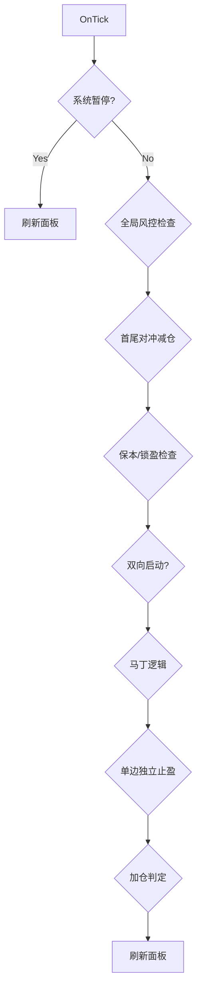

# QuantTrader Pro V3.8 需求规格说明书

## 1. 项目概述
QuantTrader Pro 是一款面向 XAUUSD 及主流外汇品种的 MT4 全自动量化交易系统。V3.8 为“低压加仓优化版”，以网格加仓为核心，强调单边独立止盈、低压手数递进、动态间距扩张和可视化操作面板。

目标：在保持顺势收割效率的同时，降低单边压力，提供可控的风险边界与更细致的人工干预能力。

## 2. 版本功能要点

### 2.1 V3.8 低压加仓优化
- **多模式加仓**：指数、斐波那契、线性三种模式可选。
- **衰减机制**：达到指定层数后使用衰减倍率，避免手数指数爆炸。
- **单笔封顶**：单笔最大手数限制。
- **动态扩距**：第 4 层起每加一层，补仓间距 +20%。
- **单边独立止盈**：按多/空总手数与目标点数换算的金额进行分开止盈。

### 2.2 V3.7 面板交互增强
- 交易状态与数据可视化面板。
- 按钮式多空开关、全平、暂停/恢复。

### 2.3 V3.6 机构级功能
- **双向启动**：可自动补齐多/空首单。
- **保本/锁盈**：达到指定盈利点数后自动推移止损。

### 2.4 V3.5 首尾对冲减仓
- 当同侧订单层数达到阈值，若最早单 + 最新单合计盈利达标，则同时平仓减压。

## 3. 交易逻辑说明

### 3.1 OnTick 主流程
1. 若系统暂停，仅刷新面板并返回。
2. 全局风控检查（当前为占位逻辑，始终通过）。
3. 若启用首尾对冲，执行减仓检测。
4. 执行保本/锁盈检查。
5. 若启用双向模式，确保多/空首单存在。
6. 执行马丁网格逻辑（独立止盈 + 加仓）。
7. 刷新面板数据。

### 3.2 独立止盈
- 多头目标金额 = 多头总手数 × `InpTargetPips` × 单位点值。
- 空头目标金额 = 空头总手数 × `InpTargetPips` × 单位点值。
- 任一方向浮盈达到目标则只平该方向持仓。

### 3.3 加仓触发与间距
- 首层与后续层使用不同的基础间距：`GridMinDist`、`GridDistLayer2`。
- 启用动态扩距后，层数 >= 4 时每层间距扩大 20%。

### 3.4 低压手数算法
- **指数模式**：手数 = 上一单手数 × 倍率；达到衰减层后改用 `InpDecayMulti`。
- **斐波那契模式**：手数 = 最近两单手数之和（首单回退至初始手数）。
- **线性模式**：手数 = 上一单手数 + 初始手数。
- 手数最终受 `InpMaxSingleLot` 封顶。

### 3.5 单边浮亏限制
- `InpSingleSideMaxLoss` > 0 时，若该方向浮盈 < -最大值，则禁止继续加仓。
- 设为 0 则不限制。

### 3.6 保本/锁盈
- 多单盈利达到 `InpBEProfitPips` 后，止损上移到开仓价 + `InpBELockPips`。
- 空单盈利达到 `InpBEProfitPips` 后，止损下移到开仓价 - `InpBELockPips`。

### 3.7 首尾对冲减仓
- 达到 `InpDestockMinLayer` 层数后，若最早单 + 最新单合计盈亏 >= `InpDestockProfit`，则同时平仓。

## 4. 参数定义

| 分组 | 参数名 | 默认值 | 说明 |
| :--- | :--- | :--- | :--- |
| **V3.8 低压加仓设置** | `InpMartinMode` | `MODE_FIBONACCI` | 加仓模式：指数/斐波那契/线性。 |
| | `InpMaxSingleLot` | 0.50 | 单笔最大手数。 |
| | `InpDecayStep` | 6 | 从第几层开始衰减倍率（指数模式）。 |
| | `InpDecayMulti` | 1.1 | 衰减后的倍率（指数模式）。 |
| | `InpGridExpansion` | true | 是否开启动态间距扩张。 |
| **V3.7 UI 面板设置** | `UI_X_Offset` | 50 | 面板 X 轴偏移。 |
| | `UI_Y_Offset` | 50 | 面板 Y 轴偏移。 |
| | `UI_ThemeColor` | `C'0,128,128'` | 面板主题色。 |
| **V3.6 机构级设置** | `InpEnableDualMode` | true | 是否启用双向启动。 |
| | `InpBEProfitPips` | 80 | 触发保本的盈利点数。 |
| | `InpBELockPips` | 10 | 保本后锁定点数。 |
| **V3.5 首尾对冲设置** | `InpEnableDualHedge` | true | 是否启用首尾对冲减仓。 |
| | `InpDestockMinLayer` | 6 | 触发减仓的最少层数。 |
| | `InpDestockProfit` | 1.0 | 首尾合计盈利门槛（货币）。 |
| **风控与核心参数** | `InpUseDynamicTP` | true | 预留开关，当前逻辑未使用。 |
| | `InpTargetPips` | 150 | 单边目标点数（用于独立止盈）。 |
| | `InpSingleSideMaxLoss` | 500.0 | 单边最大浮亏限制（货币）。 |
| | `InpMagicNum` | 999008 | 魔术号。 |
| | `InpInitialLots` | 0.01 | 初始手数。 |
| | `MartinMulti` | 1.5 | 指数模式默认倍率。 |
| | `GridMinDist` | 100 | 首次补仓间距（点）。 |
| | `GridDistLayer2` | 300 | 后续补仓间距（点）。 |

## 5. UI 交互设计 (Dashboard)
面板包含：
1. 状态行：多/空允许状态与系统暂停状态。
2. 模式与收益：当前加仓模式、今日已实现收益与收益率。
3. 目标与资金：多/空目标金额、账户余额、已用保证金、保证金比例。
4. 控制区：
   - [多头开关] / [空头开关]
   - [全平清仓]
   - [系统全线启停]

## 6. 逻辑流程图 (Mermaid)

