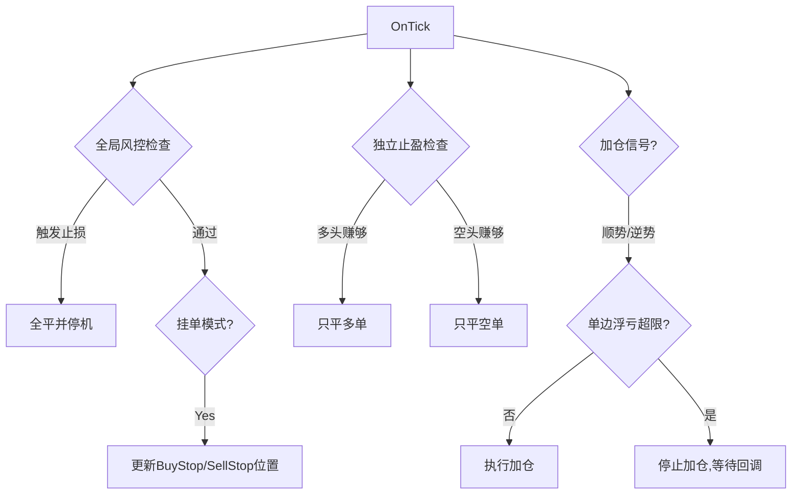

# QuantTrader Pro V3.3 需求规格说明书

## 1. 项目概述
QuantTrader Pro 是一款专为黄金 (XAUUSD) 及外汇波动品种设计的高频量化对冲交易系统。从 V3.0 的基础马丁网格，演进至 V3.1 的深度风控，再到 V3.2 的挂单追踪，最终在 V3.3 实现了机构级的“独立收割”逻辑。

目标：实现高频、顺势、快速周转的自动化交易，同时具备极强的抗风险能力。

## 2. 核心功能演进

### 2.1 V3.3 独立收割 (Independent Harvesting) [最新]
核心痛点解决：解决传统网格系统“盈利单被亏损单拖累，导致无法落袋”的问题。
- **双轨制止盈**：
    - **多头篮子 (Buy Basket)**：当所有多单浮盈总和 > `MartinBasketTP` (如 $10) 时，**立即只平多单**。
    - **空头篮子 (Sell Basket)**：当所有空单浮盈总和 > `MartinBasketTP` (如 $10) 时，**立即只平空单**。
- **优势**：资金利用率最大化。顺势方可以无限次收割，利润不断落袋，为逆势方提供安全垫。

### 2.2 V3.2 高频挂单追踪 (Stop Order Trailing)
核心痛点解决：解决市价单“一开仓即被套”及震荡行情中的无谓磨损。
- **突破挂单 (Breakout Entry)**：
    - 不再开市价单，而在现价上方 `InpPendingDist` 处挂 Buy Stop，下方挂 Sell Stop。
    - 只有行情发生真突破才成交，横盘时零持仓。
- **磁性追踪 (Magnetic Trace)**：
    - 若价格未触及挂单而反向移动，挂单会自动跟随移动，始终保持攻击距离（如 50 点）。

### 2.3 V3.1 深度风控 (Deep Risk Control)
- **单边浮亏限制 (`InpSingleSideMaxLoss`)**：当某方向（如多头）浮亏超过设定值（如 $500）时，停止该方向的加仓，防止无底洞重仓。
- **冷却期 (`InpCooldownSeconds`)**：一轮平仓后强制休息 N 秒，防止数据延迟导致的重复开单。
- **价格区间保护**：设置 `InpMaxBuyPrice` 和 `InpMinSellPrice`，防止在高位接盘或低位追空。

## 3. 详细参数定义

| 分组 | 参数名 | 默认值 | 说明 |
| :--- | :--- | :--- | :--- |
| **独立收割** | `MartinBasketTP` | 10.0 | **单边**止盈金额。多赚10平多，空赚10平空。 |
| **高频挂单** | `UseStopOrderMode` | true | 是否开启挂单追踪模式。建议开启。 |
| | `InpPendingDist` | 50 | 挂单距离现价的点数 (5 pips)。 |
| | `InpPendingTrail` | 10 | 挂单追踪步长 (1 pip)。 |
| **深度风控** | `InpSingleSideMaxLoss`| 500.0 | 单边最大浮亏限制 ($)。 |
| | `InpCooldownSeconds` | 60 | 平仓后冷却时间 (秒)。 |
| | `InpBasketSLMoney` | 1000.0 | 账户级总金额止损 (全平)。 |
| | `InpEquityProtect` | 20.0 | 净值保护比例 (%)。 |
| **基础设置** | `InpInitialLots` | 0.01 | 起始手数。 |
| | `MartinMulti` | 1.5 | 马丁加仓倍率。 |
| | `GridMinDist` | 100 | 首单补仓间距。 |
| | `GridDistLayer2` | 300 | 后续补仓间距。 |

## 4. UI 交互设计 (Dashboard)
图表左上角面板包含：
1.  **状态行**：运行中 / 冷却中 / 已停止。
2.  **盈亏行 (V3.3)**：`总盈亏: $xx.xx` | `多: $xx.xx` | `空: $xx.xx` (分立显示)。
3.  **持仓行**：`B: 1.50 lots` | `S: 0.80 lots`。
4.  **控制区**：
    - [停止交易]：一键总闸。
    - [平多头] / [平空头]：手动干预特定方向。
    - [清除挂单]：一键撤销所有 BuyStop/SellStop。
    - [全平清仓]：紧急撤退。

## 5. 逻辑流程图 (Mermaid)

